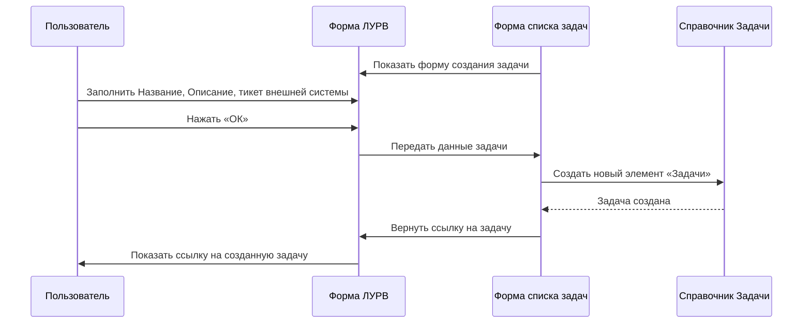
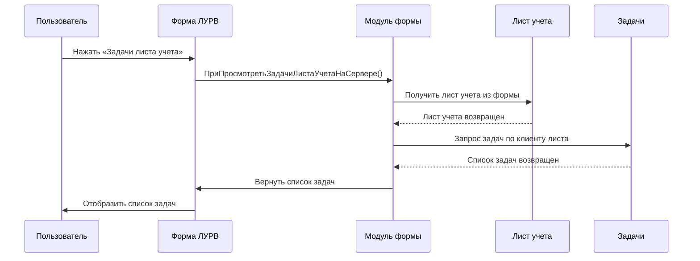
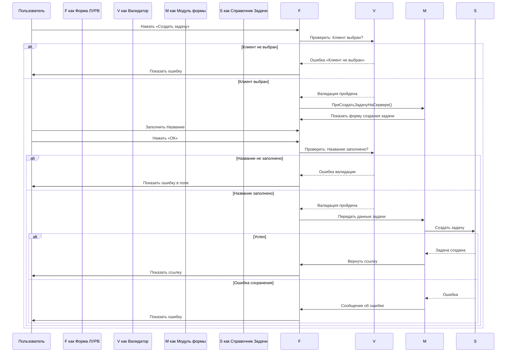
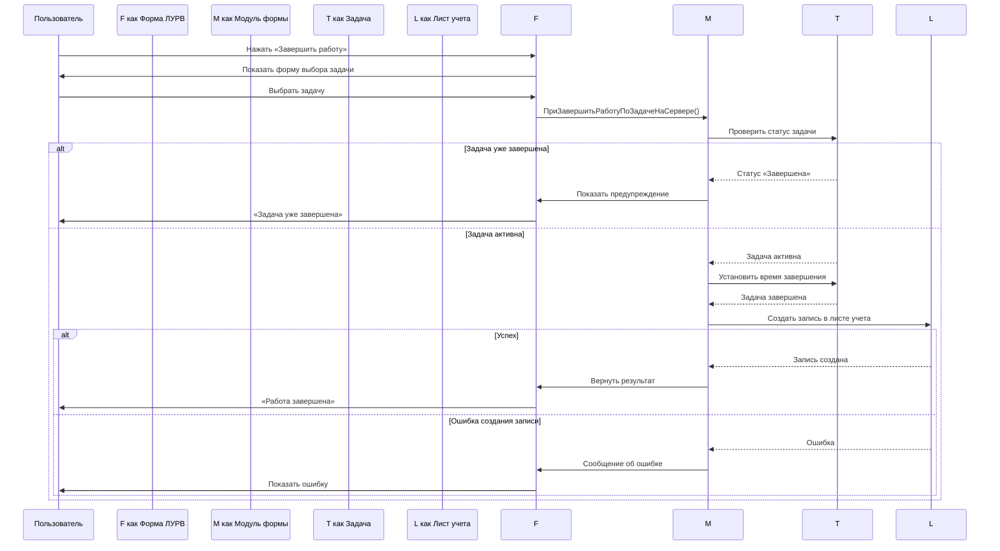
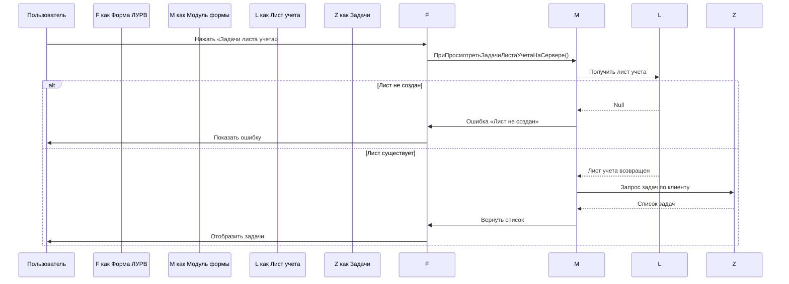

## Назначение документа

Этот документ описывает детальные сценарии команд для аналитиков и разработчиков. Он является продолжением документа по архитектуре (Архитектура.md) и содержит более низкоуровневое описание функциональности — на уровне конкретных операций, форм и бизнес-правил.

## Содержание

1. [Создание задачи из формы ЛУРВ](#1-создание-задачи-из-формы-лурв)
2. [Завершение работы по задаче](#2-завершение-работы-по-задаче)
3. [Просмотр задач в листе учета](#3-просмотр-задач-в-листе-учета)
4. [Управление задачами через форму листа учета](#4-управление-задачами-через-форму-листа-учета)
5. [Сценарии](#5-сценарии)
   1. [Сценарий: Начало работы по задаче из формы ЛУРВ](#5-сценарий-начало-работы-по-задаче-из-формы-лурв)
   2. [Сценарий: Завершение работы и создание записи в листе учета](#6-сценарий-завершение-работы-и-создание-записи-в-листе-учета)
   3. [Сценарий: Просмотр задач листа учета](#7-сценарий-просмотр-задач-листа-учета)
   4.  [Сценарий: Создание задачи из формы ЛУРВ](#8-сценарий-создание-задачи-из-формы-лурв)
   5.  [Сценарий: Завершение работы по задаче с созданием записи в листе учета](#9-сценарий-завершение-работы-по-задаче-с-созданием-записи-в-листе-учета)
   6.  [Сценарий: Просмотр задач листа учета из формы ЛУРВ](#10-сценарий-просмотр-задач-листа-учета-из-формы-лурв)

---

## 1. Создание задачи из формы ЛУРВ (ЛУР-008)

### Назначение
Позволяет сотруднику создать новую задачу для текущего клиента прямо из формы документа «Лист учета рабочего времени внешних консультантов» (ЛУРВ).

### Триггер сценария
Пользователь работает в форме ЛУРВ и нажимает кнопку «Создать задачу».

### Участники процесса
- **Пользователь** — сотрудник, ведущий лист учета
- **Форма ЛУРВ** — управляемая форма документа ЛУРВ
- **Модуль формы ЛУРВ** — бизнес-логика создания задачи
- **Справочник Задачи** — объект метаданных 1С

### Предусловия
- Форма ЛУРВ открыта в режиме изменения
- Клиент документа уже выбран (реквизит «Клиент» заполнен)
- Пользователь имеет права на создание задач

### Порядок действий

| Шаг | Действие | Результат |
|-----|----------|-----------|
| 1 | Пользователь нажимает кнопку «Создать задачу» | Вызывается процедура `ПриСоздатьЗадачуНаСервере()` |
| 2 | Формируется диалоговое окно с полями: Название, Описание, Клиент (readonly), Дата (readonly) | Пользователю показана форма создания задачи |
| 3 | Пользователь заполняет обязательные поля: Название задачи | Поля «Клиент» и «Дата» заполнены автоматически из документа |
| 4 | Пользователь нажимает «ОК» | Данные валидируются |
| 5 | Серверная процедура создает новый элемент справочника «Задачи» | Задача создана, сохранена с привязкой к клиенту и дате |
| 6 | Возвращается ссылка на созданную задачу | Пользователь видит ссылку на созданную задачу |

### Бизнес-правила
- Клиент задачи автоматически берётся из документа ЛУРВ
- Дата задачи устанавливается равной дате документа
- Название задачи — обязательное поле
- Описание задачи — необязательное поле

### После сценария
- Задача создана и привязана к клиенту
- Пользователь может вернуться к редактированию ЛУРВ или перейти к задаче по ссылке

---

## 2. Завершение работы по задаче (ЛУР-009)

### Назначение
Позволяет сотруднику завершить работу по задаче и создать запись в листе учета с указанием затраченного времени.

### Триггер сценария
Пользователь работает в форме ЛУРВ, выбрав задачу из списка доступных задач клиента, и нажимает «Завершить».

### Участники процесса
- **Пользователь** — сотрудник, завершающий работу
- **Форма ЛУРВ** — управляемая форма документа ЛУРВ
- **Модуль формы ЛУРВ** — бизнес-логика завершения работы
- **Задача** — объект метаданных «Задачи»
- **Лист учета рабочего времени внешних консультантов** — документ

### Предусловия
- Форма ЛУРВ открыта в режиме изменения
- Клиент документа уже выбран
- Задача выбрана из списка доступных задач (через форму выбора)

### Порядок действий

| Шаг | Действие | Результат |
|-----|----------|-----------|
| 1 | Пользователь нажимает кнопку «Завершить работу» | Вызывается процедура `ПриЗавершитьРаботуПоЗадачеНаСервере()` |
| 2 | Открывается форма выбора задачи для завершения | Пользователю показан список задач клиента |
| 3 | Пользователь выбирает задачу из списка | Задача передаётся на сервер |
| 4 | Серверная процедура завершает работу по задаче | Время завершения фиксируется, задача помечается как завершенная |
| 5 | Создаётся запись в листе учета с указанием затраченного времени | Запись содержит: задачу, время начала/окончания, описание работ |

### Бизнес-правила
- Время начала работы берётся из предыдущей записи или из текущего момента
- Время окончания — момент нажатия «Завершить»
- Затраченное время рассчитывается автоматически
- Запись в листе учета привязывается к задаче и клиенту

### После сценария
- Работа по задаче завершена
- Запись добавлена в лист учета
- Пользователь может продолжить работу или закрыть форму

---

## 3. Просмотр задач в листе учета (ЛУР-010)

### Назначение
Позволяет просмотреть все задачи, связанные с конкретным листом учета рабочего времени.

### Триггер сценария
Пользователь открыл документ «Лист учета рабочего времени внешних консультантов» и нажимает кнопку «Задачи листа учета».

### Участники процесса
- **Пользователь** — сотрудник, просматривающий задачи
- **Форма ЛУРВ** — управляемая форма документа ЛУРВ
- **Модуль формы ЛУРВ** — бизнес-логика получения задач
- **Лист учета** — текущий документ
- **Задачи** — объекты метаданных «Задачи»

### Предусловия
- Форма ЛУРВ открыта в режиме просмотра/изменения
- Документ ЛУРВ создан и содержит ссылку на клиента

### Порядок действий

| Шаг | Действие | Результат |
|-----|----------|-----------|
| 1 | Пользователь нажимает кнопку «Задачи листа учета» | Вызывается процедура `ПриПросмотретьЗадачиЛистаУчетаНаСервере()` |
| 2 | Серверная процедура получает лист учета из текущей формы | Лист учета определён |
| 3 | Запросом получаются все задачи, связанные с клиентом листа учета | Список задач сформирован |
| 4 | Пользователю показывается список задач | Отображаются: номер, дата создания, название, описание, статус |

### Бизнес-правила
- Показываются только задачи, привязанные к клиенту текущего листа учета
- Задачи сортируются по дате создания (новые сверху)
- Для каждой задачи отображается ссылка для перехода

### После сценария
- Пользователь видит полный список задач клиента
- Можно перейти к конкретной задаче или закрыть форму

---

## 4. Управление задачами через форму листа учета

### Доступные операции

Форма листа учета предоставляет следующие операции управления задачами:

| Операция | Описание | ЛУР-код |
|----------|----------|---------|
| Создать задачу | Создание новой задачи для клиента документа | ЛУР-008 |
| Завершить работу | Завершение работы по задаче с фиксацией времени | ЛУР-009 |
| Просмотреть задачи | Отображение списка всех задач клиента | ЛУР-010 |

### Взаимосвязь операций

```
[Начало работы] → [Создание задачи (ЛУР-008)] → [Работа по задаче] → [Завершение (ЛУР-009)]
                                                                        ↓
                                                    [Запись в лист учета] ← [Просмотр (ЛУР-010)]
```

---

## 5. Сценарии

### 1. Сценарий: Начало работы по задаче из формы ЛУРВ

#### Описание сценария
Сотрудник открывает форму листа учета, создаёт новую задачу и получает ссылку на неё для последующей работы.

#### Пользовательские роли
- **Работник** — создает тикет тайм трекинга на основании ишью зеркала внешней системы

#### Диаграмма последовательности (Mermaid)



---

#### Обработка исключений
- **Задача не выбрана** — ошибка валидации на клиенте
- **Задача уже завершена** — предупреждение пользователю
- **Ошибка создания записи в листе учета** — сообщение об ошибке от сервера 1С

---

### 7. Сценарий: Просмотр задач листа учета

#### Описание сценария
Пользователь открывает форму листа учета и просматривает все задачи, связанные с клиентом документа.

#### Диаграмма последовательности (Mermaid)



#### Обработка исключений
- **Лист учета не создан** — ошибка при попытке получения задач
- **Нет задач для клиента** — показывается пустой список с сообщением
- **Ошибка запроса** — сообщение об ошибке от сервера 1С

---

### 8. Сценарий: Создание задачи из формы ЛУРВ

#### Описание сценария
Аналогично сценарию §5, но с акцентом на валидацию данных и обработку ошибок на каждом шаге.

#### Диаграмма последовательности (Mermaid)



---

### 9. Сценарий: Завершение работы по задаче с созданием записи в листе учета

#### Описание сценария
Полный цикл завершения работы по задаче с проверками на каждом шаге.

#### Диаграмма последовательности (Mermaid)



---

### 10. Сценарий: Просмотр задач листа учета из формы ЛУРВ

#### Описание сценария
Пользователь просматривает задачи клиента через форму листа учета с фильтрацией по дате.

#### Диаграмма последовательности (Mermaid)


### Задача

---

### Лист учета рабочего времени

#### Сценарий: Начало работы над задачей

**Участники:** Сотрудник, Система

| Шаг | Кто выполняет | Действие | Результат |
|-----|---------------|----------|-----------|
| 1 | Сотрудник | Открывает форму «Лист учета» | Форма `ФормаДокумента` |
| 2 | Система | Загружает активные задачи сотрудника из GitLab | Список задач отображается |
| 3 | Сотрудник | Выбирает задачу и нажимает «Начать работу» | Фиксируется время начала |
| 4 | Система | Сохраняет время начала в сессию | Таймер запускается |

**Данные сессии:** Задача, ВремяНачала, 

---

#### Сценарий: Остановка работы

**Участники:** Сотрудник, Система

| Шаг | Кто выполняет | Действие | Результат |
|-----|---------------|----------|-----------|
| 1 | Сотрудник | Заполняет поле "окончание рабочего дня" | в последней строке в дату окончания заносится окончание рабочего дня, заполняется длительность |
| 3 | Система | Выключает обработчик автопродления записей о рабочем времени по последней задаче | обработчик больше не фурычит |

**Результат:** Время работы = ВремяОкончания − ВремяНачала

---

#### Сценарий: Отправка данных на сервер GitLab

**Участники:** Сотрудник, Система, GitLab

| Шаг | Кто выполняет | Действие | Результат |
|-----|---------------|----------|-----------|
| 1 | Сотрудник | Нажимает «Отправить отчет» | Данные подготовлены |
| 4 | Система | Отправляет комментарий через фасад | вызов специфичной обработки интеграции  |
| 5a | Успех | GitLab принимает запрос и возвращает данные переформированных записей о времени | все статусы зеленеют и реквизиты обновляются по данным гитлаб |
| 5c | Неудача | Ошибка аутентификации или таймаут | все статусы становятся серыми, значения колонок с данными внешней системы не меняются |


---

### Общие сценарии

#### Сценарий: Проверка статуса подключения к GitLab

**Участники:** Сотрудник, Система, GitLab

| Шаг | Кто выполняет | Действие | Результат |
|-----|---------------|----------|-----------|
| 1 | Система | Периодически проверяет соединение с GitLab | Запрос статуса API |
| 2a | Успех | GitLab отвечает | Статус «Подключено» |
| 2b | Неудача | Таймаут/ошибка | Статус «Отключено», уведомление сотрудника |


---

## Приложение A. Сводная таблица функций модуля формы ЛУРВ

| № | Функция (BSL) | Назначение | ЛУР-код | Статус |
|---|--------------|------------|---------|--------|
| 1 | `ПриСоздатьЗадачуНаСервере()` | Создание новой задачи для клиента документа | ЛУР-008 | В реализации |
| 2 | `ПриЗавершитьРаботуПоЗадачеНаСервере()` | Завершение работы по задаче с фиксацией времени | ЛУР-009 | В реализации |
| 3 | `ПриПросмотретьЗадачиЛистаУчетаНаСервере()` | Просмотр задач листа учета | ЛУР-010 | В реализации |
| 4 | `СоздатьЗадачу(Клиент, Дата)` | Создание задачи для клиента на дату | ЛУР-008 | В реализации |

## Приложение B. Сводная таблица задач подсистемы Таймтрекинга

| № | Задача | Описание | Ссылка на сценарий | Статус |
|---|--------|----------|-------------------|--------|
| ЛУР-003 | Создать форму листа учета рабочего времени внешних консультантов | Создание управляемой формы документа | — | Реализована |
| ЛУР-005 | Добавить команду «Создать задачу» в форму листа учета | Команда для создания задачи из формы | §5, §8 | В реализации |
| ЛУР-007 | Добавить команду «Завершить работу» в форму листа учета | Команда для завершения работы по задаче | §6, §9 | В реализации |
| ЛУР-008 | Реализовать создание задачи из формы ЛУРВ | Функция создания задачи для клиента | §5, §8 | В реализации |
| ЛУР-009 | Реализовать завершение работы по задаче из формы ЛУРВ | Функция завершения с фиксацией времени | §6, §9 | В реализации |
| ЛУР-010 | Добавить команду «Задачи листа учета» в форму листа учета | Команда просмотра задач клиента | §7, §10 | В реализации |

## Приложение C. Глоссарий

| Термин | Определение |
|--------|------------|
| **ЛУРВ** | Лист учета рабочего времени внешних консультантов — документ 1С |
| **ЛУР-XXX** | Идентификатор задачи подсистемы Таймтрекинга (ЛУР = Лист Учета Рабочего Времени) |
| **Задача** | Объект метаданных «Задачи» — запись о работе, выполняемой для клиента |
| **Лист учета** | Документ «Лист учета рабочего времени внешних консультантов» — фиксация работ за период |
| **Клиент** | Справочный элемент, к которому привязываются задачи и листы учета |
| **Начало работы** | Момент создания задачи или начала выполнения работ |
| **Завершение работы** | Момент окончания работ с фиксацией затраченного времени |
No newline at end of file
