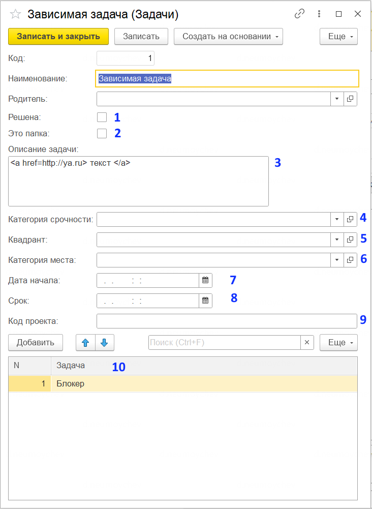

# Пользователю 

Основным рабочим местом является форма "Тудушечка-Задачи". Она разделена на 2 страницы - структура задач и актуальный список. В актуальный список попадают только задачи, которые с точки зрения системы можно делать "вотпрямщас":
1. Это не папка (флаг у задачи, а не группа справочника)
2. Их дата начала не в будущем
3. У них нет подзадач
4. У них нет нерешенных блокеров. (задача считается решенной, если у нее взведен флаг "решена" или она помечена на удаление)
5. Ее родитель не решен

При переходе из Туду к Схеме система старается спозиционироваться на выделенной задаче.  (для успеха она должна отображаться на схеме, не быть свернутой или отфильтрованной. Развернуть все задачи на схеме - `Ctrl`-`Shift`-`Num+`) При переходе обратно - нет. Так как задачу в схеме найти бывает сложно, а делать надо сверху вниз ;)

Создание задач: по умолчанию создается подзадача. Если надо сделать "соседа", то есть горячая клавиша `Ctrl-Shift-N`, для любителей MLO можно перенаправить повертойсом из `Alt-Ins`, сама 1С такую горячую клавишу назначить не может, увы.

## Форма задачи

1. Признак того, что задача решена. Используется в формировании туду, дата время решения запоминается в истории изменений
2. Если задача используется только для группировки и не должна мешаться в туду, то можно отметить что это папка
3. Описание, произвольный текст. В форме списка на страничке "интерактивное" оборачивается в теги HRML, таким образом можно сделать интерактивный список ссылок. Может я все-таки соберусь прикрутить рендер МД, и тогда ссылки делать станет проще.
4. В принципе просто справочник для сортировки. Если делать "по Кислому" то там должен быть день, контроль, неделя, позже
5. Для любителей - квадрант важно-срочно. Но на самом деле просто еще один справочник
6. Категория места - вот уж не помню, кислый это или Архангельский, но еще один фильтр-справочник. Сейчас работает сильно хуже чем контекст в MLO, но боюсь в ближайшее время не заработает, так как контекст места у меня в эксплуатации сейчас всего один
7. Дата начала - задачи с датой в будущем в Туду не отображаются, только в схеме
8. Срок - отображается в Туду. Нужен, чтобы понимать когда будут пинать тебя или когда тебе пинать исполнителей задач на контроле.
9. Код проекта - выводится в начале названия текущей задачи и всех ее детей. Удобно визуально выделять на вкладке ТУДУ задачи по разным проектам
10. Список блокирующих задач. Пока они не закрыты эта задача в Туду не попадет.

# Администрирование

По умолчанию форма задач тудушника отображается на начальном экране. 
Настройка фильтрации/группировки списков сейчас отдана на откуп пользователю. Рекомендуется для схемы поставить вот такой фильтр:
![[ТудушникРис1.png]]
Если вы уважаете [Кислого](https://time-mngmnt.narod.ru/) (или ГТД) то настройка для ТУДУ такая:
![[ТутушникРис2.png]]

# Разработчику 
Основным рабочим местом является форма списка справочника [[Задачи]]. Справочник иерархический, иерархия элементов. Представления задач вычисляются в модуле менеджера, с нарушением всех рекомендаций, но на небольшом числе работает. На 800+ уже оттормаживается, поэтому подход заменен на кеширующий регистр.
